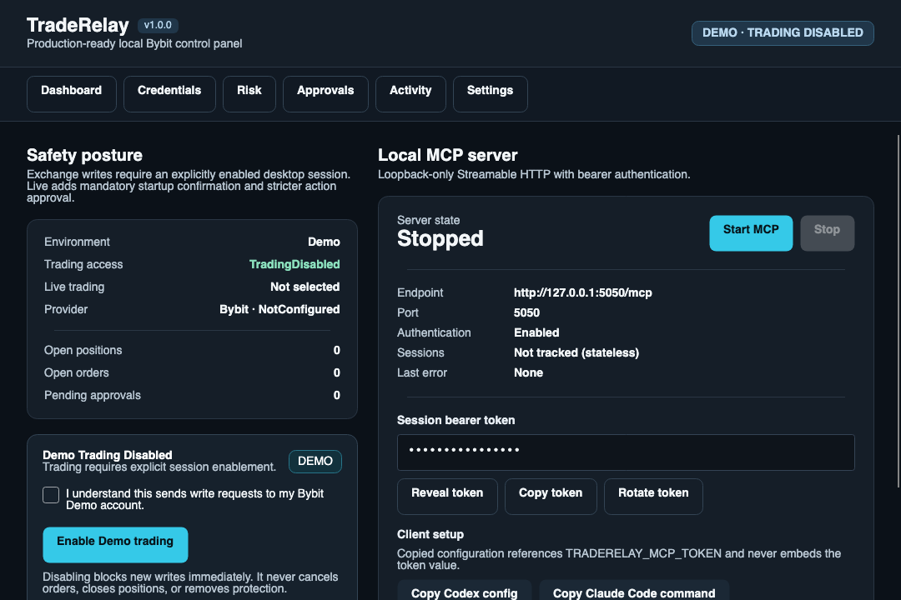
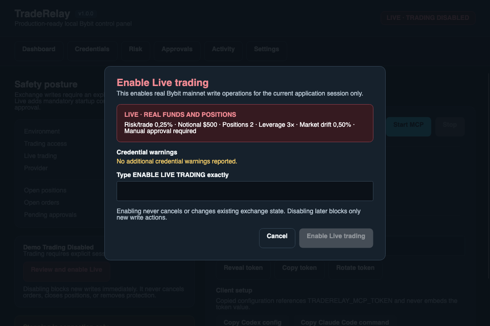

# TradeRelay


TradeRelay is a safety-first local desktop operator console that connects MCP-capable coding agents to exchange state and explicitly approved trading workflows. Version `1.3.0` adds scoped OAuth pairing, direct Codex/Claude Code/Gemini CLI installation, and the canonical `traderelay-operator` skill while Bybit remains the only connected and write-capable adapter.

TradeRelay is not a hosted trading service, autonomous strategy, signal provider, or financial adviser. It does not persist trading enablement, blindly retry ambiguous submissions, or clean up exchange orders when the application stops.

> [!CAUTION]
> Live trading can affect real funds and positions. Start with Bybit Demo, use narrowly scoped API keys, and never use a key with withdrawal permission. TradeRelay rejects withdrawal-enabled keys.

## Safety model

- Every launch starts with Demo and Live writes disabled.
- The MCP server binds only to `127.0.0.1` and requires a random bearer token.
- New orders originate from immutable, expiring prepared plans and use centralized risk, approval, audit, and reconciliation controls.
- Live enablement requires a desktop readiness review and the exact phrase `ENABLE LIVE TRADING`.
- Live cancel-all and close-position actions require short-lived desktop confirmation tickets.
- `Disable New Trading Actions` blocks new exchange writes immediately; it does not cancel orders, close positions, or remove protection.
- REST order acknowledgements remain provisional. TradeRelay uses private-stream evidence and one REST fallback lookup, never a blind placement retry.

See [the complete security model](docs/SECURITY_MODEL.md).

## Screenshots

Disabled Demo dashboard:



Live enablement confirmation:



Both release screenshots use masked tokens and contain no credentials or account data.

## Supported platforms and clients

Official portable builds are self-contained, untrimmed, non-AOT, and available for ARM64 and x64:

| Platform | Primary support | Archive |
| --- | --- | --- |
| macOS | macOS 14+ | ZIP containing exactly `TradeRelay.app` |
| Windows | Windows 11 24H2+ | Portable ZIP |
| Linux | Ubuntu 24.04 under X11 or XWayland | Portable `.tar.gz` |

Codex, Claude Code, and Gemini CLI are supported local MCP clients. TradeRelay can preview and install its MCP entry and operator skill for each client, then pair it with OAuth. Other local clients may work when they support Streamable HTTP OAuth or an environment-derived bearer header.

## Install and verify

Download the archive for your platform plus `SHA256SUMS` from the GitHub Release. Verify it before opening:

```bash
sha256sum -c SHA256SUMS
```

On macOS, `shasum -a 256 TradeRelay-1.3.0-osx-arm64.zip` can be compared with the matching line. On Windows, use `Get-FileHash .\TradeRelay-1.3.0-win-x64.zip -Algorithm SHA256`.

Packages clearly report their signing state in `release-metadata.json`. Unsigned builds are permitted when maintainers have not configured signing credentials; the operating system may show an unverified-publisher warning. Do not bypass a warning unless the checksum matches the official release.

Linux archives install nothing automatically. Extract the archive, read `README-LINUX.txt`, and run `./launch-traderelay`. Ubuntu dependencies are documented there and in [development documentation](docs/DEVELOPMENT.md).

## First run

1. Open TradeRelay. Trading is disabled.
2. Keep the environment on **Demo**.
3. Add a separate Bybit Demo API key without withdrawal permission. Session-only storage is the default.
4. Test and save the connection.
5. Review Risk settings.
6. Start the local MCP server.
7. In **Connections → Agent clients**, preview and install Codex, Claude Code, or Gemini CLI, then approve the OAuth pairing with Read & Plan scopes. Use the legacy bearer token under Advanced only when a client cannot pair.
8. Prepare and review simulated plans before explicitly enabling Demo trading.

For Live, select Live credentials, verify every warning, review the complete risk summary, and use the exact desktop confirmation. Use **Disable New Trading Actions** whenever you no longer need writes.

## Bybit capability

TradeRelay supports Bybit Unified Trading Account and USDT-linear perpetuals. Public market data, account inspection, positions, open orders, risk calculation, prepared plans, Demo execution, Live session gating, cancellation, reduce-only position closing, trading-stop updates, and reconciliation are normalized behind exchange-neutral contracts. Binance and other exchange adapters are future work.

## Local data and privacy

TradeRelay has no telemetry or crash-upload service. Non-secret settings, protected credential integrations, daily safe logs, JSONL activity audit, and diagnostics are stored under:

- macOS: `~/Library/Application Support/TradeRelay`
- Windows: `%LOCALAPPDATA%\TradeRelay`
- Linux: `~/.config/TradeRelay`

Diagnostics exports exclude credentials, tokens, authorization data, signatures, raw authenticated payloads, raw audit events, and log files.

## MCP setup

OAuth pairing is the preferred authentication path. TradeRelay discovers local Codex, Claude Code, and Gemini CLI installations, previews every command and target, and installs only after explicit confirmation. New pairings receive Read & Plan scopes; Trade requires deliberate re-pairing and never bypasses desktop trading enablement or approval.

For legacy clients, set the compatibility token in the client process environment without writing its value into client configuration:

```bash
export TRADERELAY_MCP_TOKEN='paste-the-current-token'
```

The default endpoint is `http://127.0.0.1:5050/mcp`. Settings can change the stopped server port from `1024` through `65535` or enable automatic MCP startup. Automatic startup never enables trading. See [Codex](docs/CODEX_SETUP.md), [Claude Code](docs/CLAUDE_CODE_SETUP.md), and [Gemini CLI](docs/GEMINI_CLI_SETUP.md) setup.

## Development

The repository pins .NET SDK `10.0.301` and NuGet lock files:

```bash
dotnet restore --locked-mode
dotnet build --configuration Release --no-restore
dotnet test --configuration Release --no-build
dotnet format --no-restore --verify-no-changes
```

Run the desktop shell:

```bash
dotnet run --project src/TradeRelay.Desktop
```

Project structure:

```text
src/TradeRelay.Desktop/         Avalonia shell, in-process MCP host, and application services
src/TradeRelay.Core/            Exchange-neutral domain, settings, risk, and safety contracts
src/TradeRelay.Providers.Bybit/ Bybit adapter boundary; all Bybit.Net types remain here
tests/TradeRelay.Tests/         Unit and loopback integration tests
integrations/skills/            Canonical cross-client TradeRelay operator skill
eng/                            Reproducible scans, manifests, and packaging scripts
packaging/                      Portable-platform metadata
```

See [development](docs/DEVELOPMENT.md) and [contributing](CONTRIBUTING.md) for the full workflow.

## Release status

Current version: `1.3.0`

| Milestone | Version |
| --- | --- |
| Scaffold and naming correction | `0.1.0` |
| Control panel and MCP host | `0.2.0` |
| Credentials and read-only exchange connection | `0.3.0` |
| Risk engine and order preparation | `0.4.0` |
| Demo execution | `0.5.0` |
| Live safety | `0.6.0` |
| Production-ready open-source release | `1.0.0` |
| Operator console and provider foundation | `1.1.0` |
| Operations lifecycle audit and Error Center | `1.2.0` |
| OAuth pairing, direct client installation, and operator skill | `1.3.0` |

Release maintainers should follow [the release procedure](docs/RELEASE.md). Automated real-Live write tests are prohibited.

## License and disclaimer

TradeRelay is licensed under the [MIT License](LICENSE).

Trading involves substantial risk. Software defects, network failures, exchange behavior, slippage, gaps, liquidation, fees, funding, and operator error can cause loss. You remain responsible for API-key permissions, configuration, order review, exchange state, and all resulting gains or losses.
